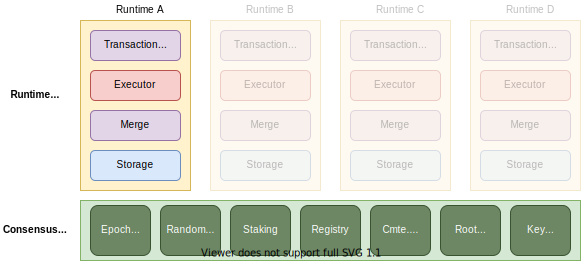

# Oasis Core

## High-Level Components

At the higest level, Oasis Core is divided into two major layers: the _consensus
layer_ and the _runtime layer_ as shown on the figure above.

The idea behind the consensus layer is to provide a minimal set of features
required to securely operate independent runtimes running in the runtime layer.
It provides the following services:

* Epoch-based time keeping and random beacon.
* Basic staking operations required to operate a PoS blockchain.
* Entity, node and runtime registry distributing public keys and metadata.
* Runtime committee scheduling, commitment processing and minimal state keeping.

On the other side, each runtime defines its own state and state transitions
independent from the consensus layer, submitting only short proofs that
computations were performed and results were stored. This means that runtime
state and logic is completely decoupled from the consensus layer, and the
consensus layer only provides information on what state (summarized by a
cryptographic hash of a Merklized data structure) is considered canonical at any
given point in time.

See the following sections for more details on specific components and their
implementations.

* [Consensus Layer](consensus/backends.md)
  * [Backends](consensus/backends.md)
  * [Transactions](consensus/transactions.md)
  * Services
    * [Epoch Time](consensus/epochtime.md)
    * [Random Beacon](consensus/beacon.md)
    * [Staking](consensus/staking.md)
    * [Registry](consensus/registry.md)
    * [Committee Scheduler](consensus/scheduler.md)
    * [Root Hash](consensus/roothash.md)
    * [Key Manager](consensus/keymanager.md)
  * Client API
* Runtime Layer
  * Transaction Processing Pipeline
    * Transaction Scheduler Nodes
    * Executor Nodes
    * Merge Nodes
    * Storage Nodes
  * [Identifiers](runtime/identifiers.md)
  * Runtimes

## Common Functionality

* [Serialization](encoding.md)
* [Cryptography](crypto.md)
* [Merklized Key-Value Store (MKVS)](mkvs.md)

## Processes

* [Release Process](release-process.md)
